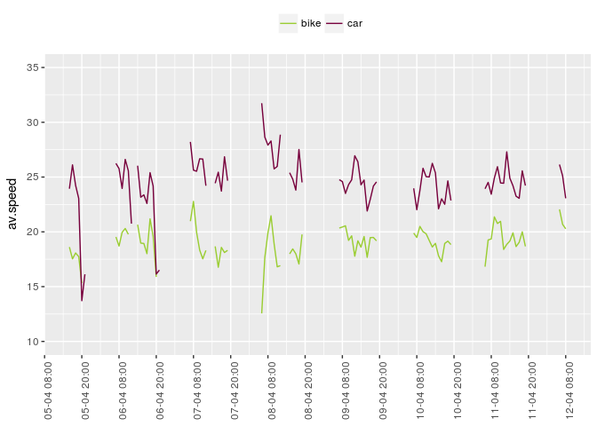
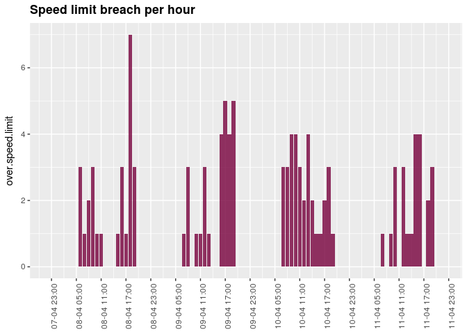

Speed cam data analysis
================

``` r
library(tidyverse)
```

    ## ── Attaching packages ───────────────────────────────────────────────────────────────────────────────── tidyverse 1.2.1 ──

    ## ✔ ggplot2 2.2.1     ✔ purrr   0.2.4
    ## ✔ tibble  1.4.2     ✔ dplyr   0.7.4
    ## ✔ tidyr   0.8.0     ✔ stringr 1.3.0
    ## ✔ readr   1.1.1     ✔ forcats 0.3.0

    ## ── Conflicts ──────────────────────────────────────────────────────────────────────────────────── tidyverse_conflicts() ──
    ## ✖ dplyr::filter() masks stats::filter()
    ## ✖ dplyr::lag()    masks stats::lag()

``` r
library(lubridate)
```

    ## 
    ## Attaching package: 'lubridate'

    ## The following object is masked from 'package:base':
    ## 
    ##     date

``` r
library(googledrive)
library(scales)
```

    ## 
    ## Attaching package: 'scales'

    ## The following object is masked from 'package:purrr':
    ## 
    ##     discard

    ## The following object is masked from 'package:readr':
    ## 
    ##     col_factor

``` r
df <- read.csv('df_after_prediction.csv',stringsAsFactors = FALSE)

df$datetime <- ymd_hm(paste(df$date,df$hour,df$minute,sep='-'))
```

    ## Warning: 3 failed to parse.

``` r
print(dim(df))
```

    ## [1] 35961    17

``` r
df <- df[!is.na(df$datetime),]
print(dim(df))
```

    ## [1] 35958    17

``` r
df$interval.datetime.hour <-  ymd_h(paste(df$date,df$hour,sep='-'))


datetime.hour.index <- data.frame(datetime.index.hour = seq(min(df$interval.datetime.hour),max(df$interval.datetime.hour),by=60*60))

df <- merge(datetime.hour.index,df,by.x='datetime.index.hour',by.y='interval.datetime.hour',all.x = TRUE)
print(dim(df))
```

    ## [1] 36033    18

``` r
df <- df %>% mutate(type = ifelse(classes==0,'car',ifelse(classes==1,'bike','NA')))


print(head(df$classes))
```

    ## [1] 0 0 1 1 0 0

``` r
df <- df %>% mutate(type=ifelse(is.na(speed), 'car', type), speed=ifelse(is.na(speed),0,speed))
print(head(df$type))
```

    ## [1] "car"  "car"  "bike" "bike" "car"  "car"

``` r
df.2 <- df %>% filter(speed==0) 
df.2<- df.2 %>% mutate(type='bike')

df<- rbind(df,df.2)

groupy <-
  df %>%
    group_by(datetime.index.hour, type) %>%
    summarise(vehicles = n(),max.speed = max(speed),av.speed = mean(speed), over.speed.limit = sum(speed>50))
```

``` r
cbPalette <- c("#9acd32","#77003c")

ggplot(df %>% filter(as.Date(datetime)>=ymd('2018-04-08')),aes(datetime.index.hour,speed, color=type))+ geom_jitter(alpha=0.2)+geom_smooth()+theme(legend.position="top",legend.title=element_blank(),axis.title.x=element_blank())+scale_colour_manual(values=cbPalette)
```

    ## `geom_smooth()` using method = 'gam'


Group by time slots
-------------------

``` r
ggplot(groupy ,aes(datetime.index.hour,av.speed,color=type))+geom_line()+theme(axis.text.x = element_text(angle=90))+
  scale_x_datetime(date_breaks = "12 hour",labels = date_format("%d-%m %H:%M"))+theme(legend.position="top")+ylim(10,35)+theme(legend.position="top",legend.title=element_blank(),axis.title.x=element_blank())+scale_colour_manual(values=cbPalette)
```



``` r
ggplot(data=groupy, aes(fill=type)) + stat_identity(data = groupy %>% filter(datetime.index.hour>'2018-04-09' &
                                                                               datetime.index.hour<'2018-04-12'), aes(datetime.index.hour, vehicles), geom = "bar", alpha = 0.8,position = "dodge")+theme(axis.text.x = element_text(angle=90))+
  scale_x_datetime(date_breaks = "12 hour",labels = date_format("%d-%m %H:%M"))+theme(legend.position="top",legend.title=element_blank(),axis.title.x=element_blank())+scale_fill_manual(values=cbPalette)
```


``` r
ggplot(data=groupy, aes(fill=type)) + stat_identity(data = groupy %>% filter(datetime.index.hour>'2018-04-08' &
                                                                               datetime.index.hour<'2018-04-12' & type=='car'), aes(datetime.index.hour, over.speed.limit), geom = "bar", alpha = 0.8,position = "dodge")+theme(axis.text.x = element_text(angle=90))+
  scale_x_datetime(date_breaks = "6 hour",labels = date_format("%d-%m %H:%M"))+theme(legend.position="top",legend.title=element_blank(),axis.title.x=element_blank())+scale_fill_manual(values='#77003c')+theme(legend.position="none")+ggtitle("Speed limit breach per hour") + 
     theme(plot.title = element_text(lineheight=.8, face="bold"))
```



``` r
df %>% top_n(10,speed) %>% select(Speed_Photo_Path,speed) %>% arrange(desc(speed))
```

    ##                                              Speed_Photo_Path speed
    ## 1  media/images/speed-20180410-0938/speed-20180410-102753.jpg 93.61
    ## 2  media/images/speed-20180410-1112/speed-20180410-123645.jpg 91.45
    ## 3  media/images/speed-20180407-1823/speed-20180408-065211.jpg 76.50
    ## 4  media/images/speed-20180411-0728/speed-20180411-075316.jpg 74.38
    ## 5  media/images/speed-20180409-1200/speed-20180409-134354.jpg 72.63
    ## 6  media/images/speed-20180407-1559/speed-20180407-165440.jpg 71.05
    ## 7  media/images/speed-20180411-0856/speed-20180411-100713.jpg 70.28
    ## 8  media/images/speed-20180409-1652/speed-20180409-165233.jpg 70.08
    ## 9  media/images/speed-20180405-1631/speed-20180405-165747.jpg 69.06
    ## 10 media/images/speed-20180409-1200/speed-20180409-120907.jpg 67.95
